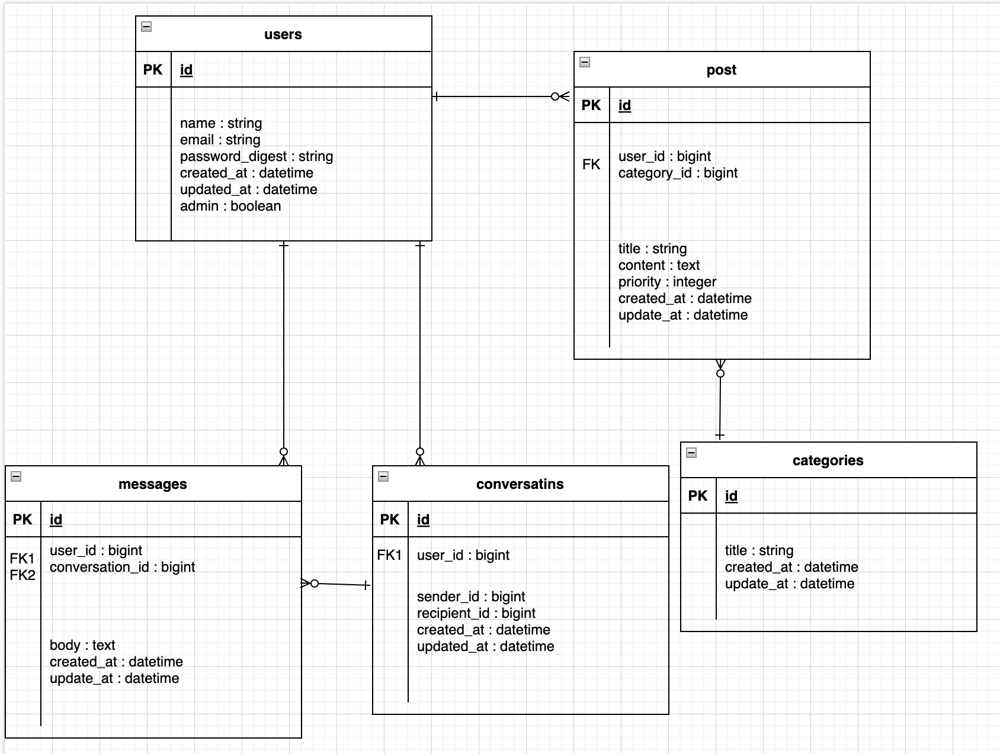
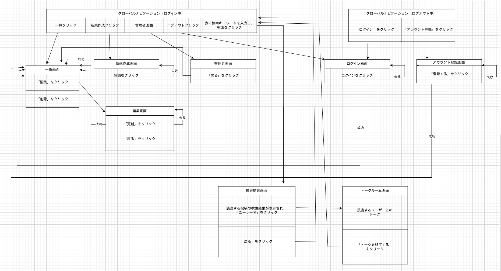
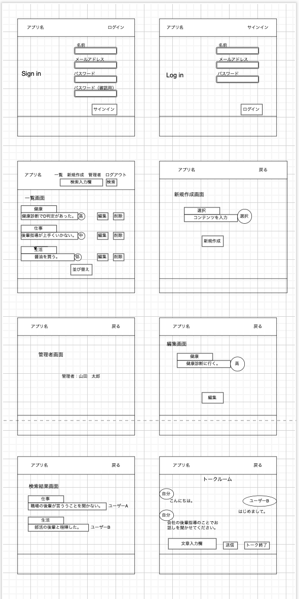

# 卒業課題
## 開発言語バージョン
 - rails 6.1.7
 - ruby 3.0.1

## 就業Termで学んだ技術
 - devise
 - メッセージ機能
 - AWS EC2

## カリキュラム外技術
 - ransack

 ## アプリケーションの実行手順
  `git clone git@github.com:oguyu2021/organized_brain.git`  
  `cd organized_brain`  
  `rails db:create`  
  `rails db:migrate`   
  `bundle install`  
  `yarn install`  
  `brew update`  
  `rails s`  

## カタログ設計、テーブル定義書の共有リンク
 [カタログ設計、テーブル定義書](https://docs.google.com/spreadsheets/d/1elaCzglV0eIKgEWPngNWVW10BCTck10vDX8elVpKe8o/edit#gid=782464957)    

##  ER図、画面遷移図、ワイヤーフレームの画像
   
 
 
   
